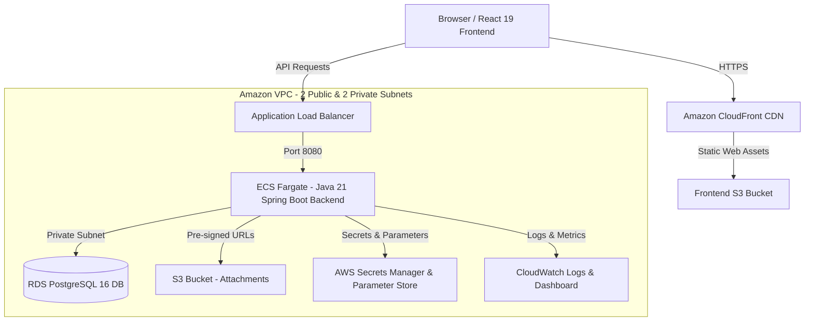

# TicketDesk Enterprise Capstone Project


**TicketDesk** is a complete, production-ready IT Support Ticket Management System built from scratch and fully deployable to AWS using Terraform Infrastructure as Code, Docker containerization, and GitHub Actions CI/CD.

---

## Technical Architecture Overview



---

## Tech Stack & Frameworks

### Frontend
- **React 19** with JavaScript (Vite)
- **React Router v6** & **React Bootstrap 5**
- **Axios** (with JWT Bearer interceptor & auto-token refresh)
- **Formik & Yup** (schema validation)
- **Recharts** (interactive dashboard statistics)
- **Lucide Icons** & Glassmorphism design system

### Backend
- **Java 21** & **Spring Boot 3.2+**
- **Spring Security** & **JWT (JSON Web Tokens)**
- **Spring Data JPA** & **Flyway Database Migrations**
- **AWS SDK v2 S3** (`S3Presigner` for direct attachment upload/download)
- **Spring Boot Actuator** (`/actuator/health`, `/actuator/metrics`)

### Infrastructure & Cloud
- **Docker & Docker Compose** (Multi-stage non-root container builds)
- **Terraform (IaC)** (Modules for VPC, ALB, ECS Fargate, ECR, RDS MySQL 8.0, S3, CloudFront, Secrets Manager, Parameter Store, IAM, Lambda, CloudWatch)
- **GitHub Actions** (Automated linting, secret scanning, Maven tests, Docker build/push, Terraform plan/apply, rolling ECS deployment, and smoke tests)

---

## Quickstart: Local Docker Deployment

Run the complete stack locally using Docker Compose:

```bash
# Clone the repository
git clone https://github.com/kasiviswanadhamchalla/ticketdesk.git
cd ticketdesk

# Build and start PostgreSQL, Spring Boot Backend, and React Frontend
docker compose up --build -d

# Verify container health
docker compose ps
```

- **Frontend Portal**: `http://localhost`
- **Backend API**: `http://localhost:8080/api`
- **Health Endpoint**: `http://localhost:8080/api/actuator/health`

### Default Login Credentials (Seeded)
- **Admin**: `admin` / `Admin@123`
- **Support Engineer**: `support@ticketdesk.com` / `Admin@123`
- **Employee**: `employee@ticketdesk.com` / `Admin@123`

---

## AWS Deployment with Terraform

```bash
cd infrastructure/terraform/environments/prod

# Initialize Terraform modules
terraform init

# Validate configuration
terraform validate

# Review execution plan
terraform plan

# Apply infrastructure creation on AWS
terraform apply -auto-approve
```

---

## Project Structure

```
TicketDesk/
├── backend/                # Spring Boot 3 Java 21 Application
│   ├── src/
│   ├── Dockerfile          # Multi-stage Java 21 build with non-root appuser
│   └── pom.xml
├── frontend/               # React 19 Vite Web Application
│   ├── src/
│   ├── Dockerfile          # Multi-stage Node 20 -> Nginx build
│   └── nginx.conf
├── infrastructure/         # Infrastructure as Code
│   └── terraform/
│       ├── modules/        # Modular IaC (vpc, alb, ecs, rds, ecr, s3, cloudfront, secrets, iam, lambda, cloudwatch)
│       └── environments/
│           └── prod/       # Production environment deployment setup
├── .github/
│   └── workflows/
│       └── deploy.yml      # CI/CD GitHub Actions Pipeline
├── docs/                   # Detailed Technical Documentation
│   ├── architecture.md
│   ├── deployment-guide.md
│   ├── runbook.md
│   ├── troubleshooting.md
│   ├── api-docs.md
│   ├── db-schema.md
│   └── cost-estimation.md
├── docker-compose.yml      # Local container stack orchestration
└── README.md
```

---

## Documentation Index

- [Architecture Specification](docs/architecture.md)
- [AWS Deployment Guide](docs/deployment-guide.md)
- [Operational Runbook](docs/runbook.md)
- [Troubleshooting Guide](docs/troubleshooting.md)
- [REST API Reference](docs/api-docs.md)
- [Database Schema & ERD](docs/db-schema.md)
- [AWS Cost Estimation](docs/cost-estimation.md)
