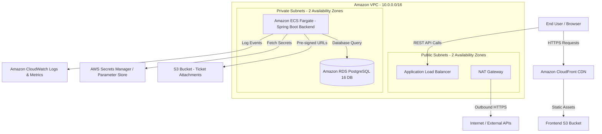

# TicketDesk System Architecture

TicketDesk is an enterprise-grade IT Support Ticket Management System engineered for high availability, security, and scalability on Amazon Web Services (AWS).

---

## 1. High-Level Architecture Diagram

---

## 2. Key Architectural Layers

### Frontend Layer
- **Framework**: React 19 + JavaScript (Vite)
- **UI & Styling**: React Bootstrap + Glassmorphism Vanilla CSS + Lucide Icons
- **State & Form Management**: React Context API (`AuthContext`, `NotificationContext`) + Formik + Yup
- **Hosting & CDN**: Amazon S3 Static Web Hosting backed by Amazon CloudFront CDN with TLS/SSL encryption and SPA fallback routing.

### Backend Layer
- **Framework**: Java 21 + Spring Boot 3.2+
- **Security & Auth**: Spring Security + JWT (JSON Web Tokens) with Refresh Token flow & BCrypt password hashing.
- **Data Access**: Spring Data JPA + Hibernate + Flyway SQL Migrations.
- **File Management**: Direct AWS S3 integration via AWS SDK v2 (`S3Presigner`) for zero-server-overhead binary file uploads.
- **Compute**: Amazon ECS Fargate containerized application running in private subnets across multiple Availability Zones with Auto-Scaling (CPU target 75%).

### Database & Storage Layer
- **Database**: Amazon RDS PostgreSQL 16 (Multi-AZ capable, encrypted storage with AWS KMS).
- **Object Storage**: Amazon S3 bucket with strict CORS policies, AES256 server-side encryption, and pre-signed URL security for file attachments.

### Monitoring & Security Layer
- **Secrets**: AWS Secrets Manager for DB passwords & JWT keys; Parameter Store for configuration endpoints.
- **Logging & Telemetry**: CloudWatch Logs, Metrics, Custom Dashboard, and Alarms (High CPU, Memory, 5XX errors, Unhealthy Targets).
- **IAM**: Principle of Least Privilege with separate ECS Execution Role and Task Role.
