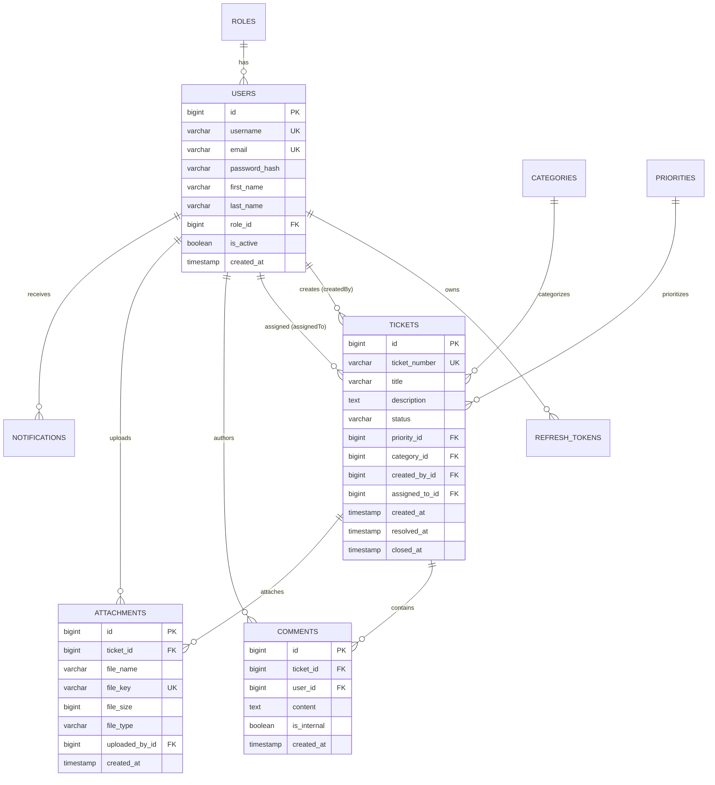

# TicketDesk Database Schema (MySQL 8.0)

This document describes the relational database schema managed by **Flyway SQL Migrations** on **MySQL 8.0** / **Amazon RDS MySQL**.

---

## 1. Entity Relationship (ER) Diagram

---

## 2. Table Field Specifications

### `users`
| Column | Type | Constraints | Description |
| :--- | :--- | :--- | :--- |
| `id` | `BIGSERIAL` | `PRIMARY KEY` | Unique User ID |
| `username` | `VARCHAR(50)` | `NOT NULL, UNIQUE` | Login username |
| `email` | `VARCHAR(100)` | `NOT NULL, UNIQUE` | User email address |
| `password_hash` | `VARCHAR(255)` | `NOT NULL` | BCrypt password hash |
| `role_id` | `BIGINT` | `REFERENCES roles(id)` | User Role FK |
| `is_active` | `BOOLEAN` | `DEFAULT TRUE` | Account status flag |

### `tickets`
| Column | Type | Constraints | Description |
| :--- | :--- | :--- | :--- |
| `id` | `BIGSERIAL` | `PRIMARY KEY` | Unique Ticket ID |
| `ticket_number` | `VARCHAR(20)` | `NOT NULL, UNIQUE` | Formatted number e.g. `TICK-1001` |
| `title` | `VARCHAR(200)` | `NOT NULL` | Ticket subject |
| `description` | `TEXT` | `NOT NULL` | Detailed problem description |
| `status` | `VARCHAR(30)` | `NOT NULL` | `OPEN`, `IN_PROGRESS`, `RESOLVED`, `CLOSED`, `REOPENED` |
| `priority_id` | `BIGINT` | `REFERENCES priorities(id)` | Priority FK |
| `category_id` | `BIGINT` | `REFERENCES categories(id)` | Category FK |
| `created_by_id` | `BIGINT` | `REFERENCES users(id)` | Creator User FK |
| `assigned_to_id` | `BIGINT` | `REFERENCES users(id)` | Assigned Engineer User FK |
