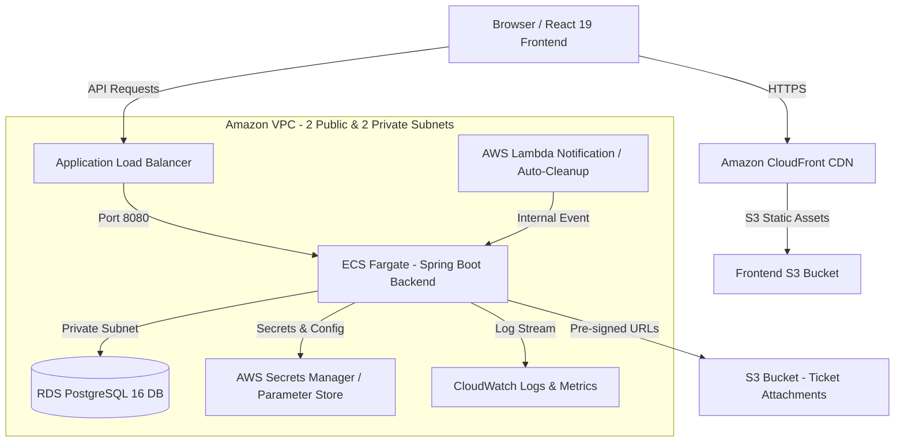

# Implementation Plan - TicketDesk Enterprise Capstone Project

Build a complete, enterprise-grade, production-ready IT Support Ticket Management System (**TicketDesk**) from scratch, deployable on AWS with full IaC (Terraform), Dockerization, CI/CD (GitHub Actions), and Monitoring (CloudWatch).

---

## Required Inputs & Production Defaults

Per the project prompt instructions, below are the required deployment parameters and our secure production defaults:

| Parameter | User / Production Default | Notes |
| :--- | :--- | :--- |
| **Git Repository URL** | `https://github.com/example/ticketdesk.git` (Default) | Overridable in GitHub Actions & Terraform variables |
| **AWS Region** | `us-east-1` (Default) | Highly available AWS Region with all required services |
| **AWS Account ID** | `123456789012` (Placeholder) | Provided via GitHub Secrets / Terraform AWS Provider |
| **GitHub Personal Access Token** | Configured in GitHub Secrets (`GH_PAT`) | Used for CI/CD automation & ECR authentication |
| **Preferred Database** | **PostgreSQL 16** (Default) | Managed via Amazon RDS PostgreSQL & Flyway migrations |

> [!NOTE]
> If you wish to override any of the defaults above (e.g., custom AWS Region or Account ID), please let us know before approving the plan. Otherwise, we will proceed using these secure production defaults.

---

## Architectural Overview



---

## Project Directory Structure

```
TicketDesk/
├── backend/
│   ├── src/
│   │   ├── main/
│   │   │   ├── java/com/ticketdesk/
│   │   │   │   ├── config/ (Security, CORS, OpenAPI, S3, JWT)
│   │   │   │   ├── controller/ (Auth, Ticket, User, Category, Priority, Comment, Attachment, Notification, Admin)
│   │   │   │   ├── dto/ (Requests, Responses, Mappers)
│   │   │   │   ├── entity/ (User, Role, Ticket, Category, Priority, Comment, Attachment, Notification, RefreshToken)
│   │   │   │   ├── exception/ (GlobalExceptionHandler, CustomExceptions)
│   │   │   │   ├── repository/ (JpaRepositories)
│   │   │   │   ├── security/ (JwtTokenProvider, JwtAuthFilter, UserDetailsServiceImpl)
│   │   │   │   ├── service/ (Auth, Ticket, User, Comment, Attachment, Notification, Email)
│   │   │   │   └── TicketDeskApplication.java
│   │   │   └── resources/
│   │   │       ├── db/migration/ (V1__init_schema.sql, V2__seed_data.sql)
│   │   │       ├── application.yml
│   │   │       └── application-prod.yml
│   ├── Dockerfile
│   ├── pom.xml
│   └── README.md
├── frontend/
│   ├── src/
│   │   ├── api/ (axiosInstance, authApi, ticketApi, userApi, attachmentApi)
│   │   ├── components/ (Navbar, Sidebar, Footer, LoadingSpinner, ProtectedRoute, TicketCard, CommentSection)
│   │   ├── context/ (AuthContext, NotificationContext)
│   │   ├── pages/ (Login, Register, Dashboard, TicketList, TicketDetail, CreateTicket, Profile, AdminPanel)
│   │   ├── utils/ (formatters, constants, helpers)
│   │   ├── App.jsx
│   │   ├── index.css
│   │   └── main.jsx
│   ├── public/
│   ├── index.html
│   ├── package.json
│   ├── vite.config.js
│   ├── Dockerfile
│   └── README.md
├── infrastructure/
│   ├── terraform/
│   │   ├── modules/ (vpc, alb, ecs, rds, s3, cloudfront, cloudwatch, iam, secrets, lambda)
│   │   ├── environments/
│   │   │   └── prod/ (main.tf, variables.tf, outputs.tf, terraform.tfvars)
│   └── README.md
├── .github/
│   └── workflows/
│       └── deploy.yml
├── docs/
│   ├── architecture.md
│   ├── deployment-guide.md
│   ├── runbook.md
│   ├── troubleshooting.md
│   ├── api-docs.md
│   ├── db-schema.md
│   └── cost-estimation.md
├── docker-compose.yml
└── README.md
```

---

## Milestones & Execution Strategy

### Milestone 1: Repository & Project Initialization
- Create complete project directory hierarchy.
- Initialize `backend` with Maven `pom.xml` (Java 21, Spring Boot 3.2+, Dependencies: Web, Security, Data JPA, Validation, PostgreSQL, Flyway, Lombok, MapStruct, Actuator, JWT, AWS SDK S3).
- Initialize `frontend` with Vite, React 19, JavaScript, React Router, React Bootstrap, Axios, Formik, Yup, Lucide Icons.

### Milestone 2: Java Spring Boot 3 Backend Implementation
- **Entities & DB Migration**: Flyway SQL scripts for `users`, `roles`, `refresh_tokens`, `categories`, `priorities`, `tickets`, `comments`, `attachments`, `notifications`.
- **Security & JWT**: JWT Access & Refresh token management, BCrypt password hashing, Role-based authorization (`ROLE_ADMIN`, `ROLE_SUPPORT_ENGINEER`, `ROLE_EMPLOYEE`).
- **REST Services & Controllers**:
  - Authentication (Login, Register, Refresh Token, Change Password, Forgot Password).
  - User & Profile Management (CRUD, Role assignment).
  - Ticket Engine (Create, Edit, Status Transition, Priority/Category Filter, Search, Pagination, Assignment).
  - Comments & Activity Logs.
  - S3 Pre-signed Upload & Download Endpoint for Attachments.
  - In-App & Email Notifications Engine.
- **Global Error Handling & Validation**: `@RestControllerAdvice`, standard error DTOs, Actuator endpoints (`/actuator/health`, `/actuator/metrics`).

### Milestone 3: React 19 Frontend Application Implementation
- **Theme & Aesthetics**: High-end modern UI with custom glassmorphism styling, dark/light harmonious color palette, dynamic stats charts, and responsive navigation.
- **Authentication Flow**: Protected routes, JWT token storage, auto refresh token interceptor, login & registration forms.
- **Dashboard**: Real-time stats widgets (Open vs Closed, Priority distribution charts, recent tickets table).
- **Ticket Management**: Advanced search, multi-criteria filtering, pagination, ticket detail view with interactive comment thread, attachment file uploader with drag-and-drop & download links.
- **Admin Panel**: User role management, category/priority management system.

### Milestone 4: Dockerization & Local Orchestration
- **Backend Dockerfile**: Multi-stage build (Maven compile stage -> Distroless/JRE 21 runtime with non-root user `appuser`, health check, optimized memory flags).
- **Frontend Dockerfile**: Multi-stage build (Node 20 build -> Nginx Alpine production server with custom reverse proxy configuration).
- **Docker Compose**: Orchestrate PostgreSQL 16 container, backend service, frontend service, local network, healthchecks, and environment variables.

### Milestone 5: Infrastructure as Code (Terraform)
- **VPC Module**: Custom VPC, 2 Public Subnets, 2 Private Subnets, IGW, NAT Gateways, Route Tables.
- **Security Groups & IAM**: Least privilege IAM roles for ECS Task Execution, ECS Task, Lambda, S3 access policies, DB Security Groups.
- **RDS PostgreSQL Module**: Multi-AZ capable private RDS PostgreSQL instance, encrypted storage, subnet group, parameter store connection strings.
- **S3 & CloudFront Module**: S3 bucket for frontend hosting with CloudFront Distribution + S3 bucket for ticket attachments with CORS & lifecycle policies.
- **ALB Module**: Application Load Balancer in public subnets, HTTPS listener, Target Group with health check (`/actuator/health`).
- **ECS Fargate Module**: ECS Cluster, Task Definition (Java backend container), Fargate Service, Auto-scaling policy based on CPU/Memory.
- **Secrets Manager & Parameter Store**: Secure storage for DB passwords, JWT Secret Keys, AWS S3 keys.
- **Lambda Module**: Event-driven notification processor / maintenance Lambda function with proper execution role.

### Milestone 6: CI/CD Pipeline (GitHub Actions)
- Automated `.github/workflows/deploy.yml`:
  1. Code Linting & Secret Scanning (`gitleaks` / `trivy`).
  2. Backend Unit & Integration Tests (`mvn test`).
  3. Build & push Docker images to Amazon ECR.
  4. Terraform Plan & Apply.
  5. ECS Service Deployment with rolling updates and automated rollback on failure.
  6. Post-deployment Smoke Tests against ALB health check endpoint.

### Milestone 7: AWS CloudWatch Monitoring & Alerts
- CloudWatch Log Groups for ECS tasks and Lambda functions.
- Custom CloudWatch Dashboard for TicketDesk: CPU, Memory, 5xx errors, Target Response Time, DB CPU utilization, Database Connections.
- CloudWatch Alarms for ECS High CPU (>80%), High Memory (>80%), High 5xx error rate, RDS High CPU (>85%), Unhealthy ALB Target Count (>0).

### Milestone 8: Enterprise Documentation
- Complete, highly detailed technical documentation in `docs/`:
  - `architecture.md` (System architecture, data flow)
  - `deployment-guide.md` (Step-by-step AWS deployment walkthrough)
  - `runbook.md` (Operations, scaling, backup & recovery)
  - `troubleshooting.md` (Common errors & resolutions)
  - `api-docs.md` (Swagger / REST API reference)
  - `db-schema.md` (ER diagram & table specs)
  - `cost-estimation.md` (Monthly AWS cost breakdown)
  - Root `README.md` summarizing the entire solution.

---

## Verification Plan

### Automated Verification
- Maven build & test execution: `mvn clean test` in `backend/`.
- Frontend build validation: `npm run build` in `frontend/`.
- Docker Compose local stack validation: `docker compose up --build -d` & health check curl commands.
- Terraform syntax and validation check: `terraform validate` and `terraform plan` in `infrastructure/terraform/environments/prod`.

### Manual / Integration Verification
- Verify JWT Authentication (Login, Refresh, Role restriction).
- Verify Ticket lifecycle (Create -> Assign -> Comment -> Attachment Upload -> Close -> Reopen).
- Verify Pre-signed S3 URL generation.
- Verify Healthcheck endpoints (`/actuator/health`).
