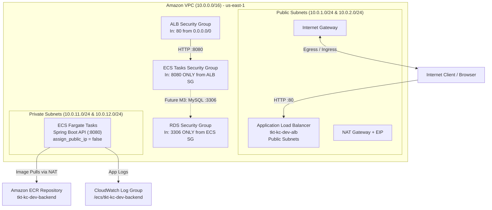

# TicketDesk AWS Capstone Infrastructure (Terraform M2 Focus)

Production-grade, modular Infrastructure as Code (IaC) for the **TicketDesk** application on AWS.

This repository implements **Milestone 2 (M2)** completely, providing an automated foundation including VPC, subnets, NAT/IGW routing, security groups, least-privilege IAM roles, Application Load Balancer (ALB), Amazon ECR repository, ECS Fargate cluster, task definition, private ECS service, and CloudWatch log groups.

---

## Architecture Overview



---

## Directory Structure

```
infrastructure/terraform/
├── versions.tf               # Terraform CLI & Provider version constraints
├── providers.tf              # AWS provider initialization & default_tags
├── variables.tf              # Strongly-typed input variables with validation
├── locals.tf                 # Local helper values & common tag maps
├── outputs.tf                # Exported resource identifiers & DNS endpoints
├── main.tf                   # Core entry point orchestrating submodules
├── terraform.tfvars.example  # Sample configuration values for local development
├── backend.tf.example        # S3 + DynamoDB remote state configuration example
├── README.md                 # Complete documentation & operational guide
│
└── modules/
    ├── networking/           # VPC, subnets, IGW, NAT GW, and route tables
    │   ├── main.tf
    │   ├── variables.tf
    │   └── outputs.tf
    ├── security/             # Security Groups and least-privilege IAM Roles
    │   ├── main.tf
    │   ├── variables.tf
    │   └── outputs.tf
    ├── alb/                  # Application Load Balancer, Target Group & Listener
    │   ├── main.tf
    │   ├── variables.tf
    │   └── outputs.tf
    ├── ecr/                  # Amazon ECR repository with scanning & lifecycle
    │   ├── main.tf
    │   ├── variables.tf
    │   └── outputs.tf
    └── ecs/                  # CloudWatch log group, ECS Cluster, Task Def & Service
        ├── main.tf
        ├── variables.tf
        └── outputs.tf
```

---

## AWS Resource Deep-Dive & Dependency Graph

Below is the detailed reference for every resource created by this Terraform project:

| Resource Name / Type | AWS Resource | Purpose / Requirement | Subnet / Scope | Security Group | Traffic Flow | Safe to Modify | Destroy Impact |
| :--- | :--- | :--- | :--- | :--- | :--- | :--- | :--- |
| `aws_vpc.main` | VPC (`10.0.0.0/16`) | Provides network isolation for all AWS resources | Regional VPC | N/A | Wraps all subnets and resources | Tags, DNS attributes | Destroys all contained subnets, gateways, and workloads |
| `aws_subnet.public[*]` | Public Subnets (2 AZs) | Hosts public entry points (ALB & NAT Gateway) | Public (AZ 1 & AZ 2) | N/A | Receives traffic directly from IGW | CIDR block, tags | Destroys ALB and NAT GW in those subnets |
| `aws_subnet.private[*]` | Private Subnets (2 AZs) | Hosts backend API workloads securely | Private (AZ 1 & AZ 2) | N/A | Reached only via ALB internal routing | CIDR block, tags | Destroys ECS tasks running in private tier |
| `aws_internet_gateway.igw` | Internet Gateway | Enables public internet communication for public subnets | VPC Gateway | N/A | Bidirectional internet traffic for public subnets | Tags | Cuts public ingress to ALB and egress to NAT GW |
| `aws_nat_gateway.nat[*]` | NAT Gateway | Allows private ECS tasks outbound access (ECR pulls, AWS APIs) | Public Subnet 1 | N/A | Egress-only for private subnets -> Internet | Count (`enable_nat_gateway`), single vs multi | Private ECS tasks lose internet/ECR connectivity |
| `aws_security_group.alb` | ALB Security Group | Firewall rule allowing public entry to ALB on port 80 | VPC Level | Attached to ALB | Inbound 80 from `0.0.0.0/0` -> ALB | Inbound CIDR/ports | ALB drops incoming public requests |
| `aws_security_group.ecs_tasks` | ECS Tasks Security Group | Strict firewall allowing ingress ONLY from ALB SG on port 8080 | VPC Level | Attached to ECS Tasks | Inbound 8080 from ALB SG -> ECS | Container port | ECS tasks drop traffic forwarded by ALB |
| `aws_security_group.rds` | RDS Security Group (M3) | Prepared firewall allowing ingress ONLY from ECS SG on port 3306 | VPC Level | Reserved for RDS | Inbound 3306 from ECS SG -> RDS | Engine port | Database connection refused if attached |
| `aws_lb.main` | Application Load Balancer | Distributes public web requests across ECS Fargate tasks | Public Subnets | `alb_security_group` | Internet :80 -> ALB Listener -> Target Group | Deletion protection, idle timeout | Service becomes unreachable from the internet |
| `aws_lb_target_group.backend` | ALB Target Group | Tracks IP endpoints of healthy ECS Fargate tasks | VPC Level | N/A | Receives traffic from ALB :80 -> forwards to ECS :8080 | Health check path, thresholds | ALB loses target destination; requests return 503 |
| `aws_ecr_repository.backend` | ECR Repository | Stores Docker images for TicketDesk backend API | Regional ECR | N/A | Pushed by CI/CD -> Pulled by ECS | Lifecycle policies, image scanning | Stored container images are permanently lost |
| `aws_ecs_cluster.main` | ECS Fargate Cluster | Logical grouping for Fargate task execution | Regional | N/A | Manages ECS service container lifecycle | Container insights setting | Terminates all running tasks in cluster |
| `aws_ecs_task_definition.backend` | Task Definition | Container specification (CPU, Memory, Ports, Environment) | Regional | N/A | Tells ECS agent how to launch container | Image URI, CPU, Memory, env vars | New tasks cannot launch until re-created |
| `aws_ecs_service.backend` | ECS Fargate Service | Ensures specified number of tasks are running in private subnets | Private Subnets | `ecs_tasks_security_group` | Target Group -> ECS Task :8080 | Desired count, deployment configuration | Running container instances are stopped |
| `aws_cloudwatch_log_group.ecs` | CloudWatch Log Group | Aggregates stdout/stderr container application logs | Regional | N/A | ECS `awslogs` driver -> CloudWatch | Retention period (`log_retention_days`) | Historical container logs are deleted |

---

## Terraform Execution Commands

Execute commands in sequence from `infrastructure/terraform/`:

### 1. Format Code
```bash
terraform fmt -recursive
```
*Formatively formats all `.tf` files across root and submodules to strictly conform to standard HCL style conventions.*

### 2. Initialize Working Directory
```bash
terraform init
```
*Downloads the AWS provider plugin (`hashicorp/aws`), initializes submodule references, and prepares the local or remote state backend.*

### 3. Validate Syntax & Logic
```bash
terraform validate
```
*Verifies internal consistency of configuration files, syntax correctness, and variable type enforcement.*

### 4. Generate Execution Plan
```bash
terraform plan -var-file=terraform.tfvars.example
```
*Compares existing real-world AWS infrastructure state against desired code state, outputting exact actions (create/update/destroy).*

### 5. Apply Changes
```bash
terraform apply -var-file=terraform.tfvars.example -auto-approve
```
*Provisions or updates AWS infrastructure resources to match the configuration.*

### 6. Inspect Outputs
```bash
terraform output
```
*Displays exported infrastructure identifiers (VPC ID, ALB DNS Name, ECR URL, Cluster Name).*

### 7. Destroy Infrastructure
```bash
terraform destroy -var-file=terraform.tfvars.example -auto-approve
```
*Safely teardown and removes all provisioned AWS resources cleanly in reverse dependency order.*

---

## Post-Deployment Verification Checklist

Execute these 17 verification steps to validate successful deployment:

1. **Verify VPC Creation:** Confirm VPC `tkt-kc-dev-vpc` exists with CIDR `10.0.0.0/16`.
2. **Verify 2 Public Subnets:** Confirm two public subnets exist in distinct Availability Zones with `map_public_ip_on_launch = true`.
3. **Verify 2 Private Subnets:** Confirm two private subnets exist in distinct Availability Zones with `map_public_ip_on_launch = false`.
4. **Verify Internet Gateway:** Confirm IGW `tkt-kc-dev-igw` is attached to the VPC.
5. **Verify NAT Gateway:** Confirm NAT Gateway `tkt-kc-dev-nat-gw-1` has an Elastic IP assigned and sits in Public Subnet 1.
6. **Verify Route Tables:** Confirm public route table points `0.0.0.0/0 -> IGW` and private route table points `0.0.0.0/0 -> NAT Gateway`.
7. **Verify Security Groups:** Confirm `alb-sg` accepts port 80 from `0.0.0.0/0` and `ecs-tasks-sg` accepts port 8080 **only** from `alb-sg`.
8. **Verify ALB:** Confirm ALB `tkt-kc-dev-alb` is active, public-facing, and assigned both public subnets.
9. **Verify Target Group:** Confirm target group `tkt-kc-dev-backend-tg` target type is `ip` on port 8080 with health check path `/actuator/health`.
10. **Verify ECS Cluster:** Confirm cluster `tkt-kc-dev-cluster` is active with Container Insights enabled.
11. **Verify ECS Service:** Confirm service `tkt-kc-dev-backend-service` desired count is 1 and status is active.
12. **Verify ECS Task Location:** Confirm running ECS task ENI resides inside a **private subnet**.
13. **Verify Private IP Only:** Confirm the running ECS task ENI has **no public IP address assigned**.
14. **Verify Target Health:** Confirm ALB Target Group health check status transitions to `Healthy`.
15. **Open ALB DNS URL:** Copy `alb_dns_name` output and open in browser or curl.
16. **Verify Health Endpoint:** Execute `curl http://<ALB_DNS_NAME>/actuator/health` and verify HTTP 200 OK output (`{"status":"UP"}`).
17. **Verify CloudWatch Logs:** Navigate to CloudWatch Log Group `/ecs/tkt-kc-dev-backend` and verify container logs are arriving.

---

## Roadmap & Milestone Integration (M3–M8)

This Terraform project is designed as the foundational core for TicketDesk AWS deployment:

- **M2 (Implemented):** VPC, Subnets, Gateways, Security Groups, ALB, ECR, ECS Fargate, CloudWatch.
- **M3 (Extensible Prep):** RDS MySQL in private subnets, Secrets Manager database password storage, SSM Parameter Store application settings. (See RDS Security Group in `modules/security`).
- **M4 (Future):** S3 bucket for static React frontend hosting + Amazon CloudFront CDN distribution.
- **M5 (Future):** S3 bucket for ticket attachments, pre-signed upload URL support, and Lambda thumbnail generation.
- **M6 (Future):** GitHub Actions CI/CD workflows utilizing `ecr_repository_url` and `ecs_service_name` outputs.
- **M7 (Future):** CloudWatch dashboards and composite alarms (CPU > 80%, ALB 5xx errors).
- **M8 (Future):** Fine-grained IAM policy hardening, cost allocation tags, and automated teardown scripts.
