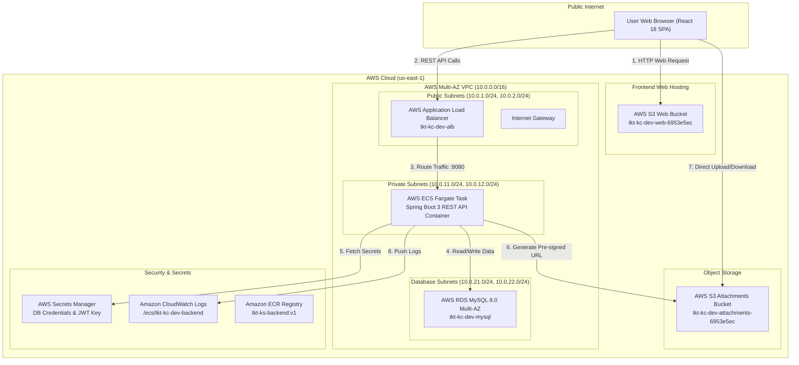
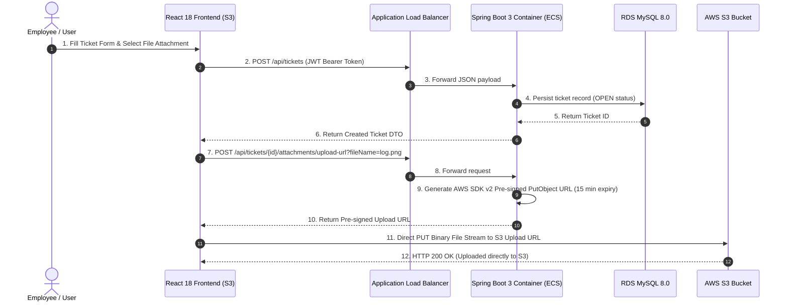

# 🚀 TicketDesk - Enterprise IT Support & Incident Management Platform
## Complete POC Project Evaluation & Technical Documentation

> **Project Name**: TicketDesk Enterprise Support Platform  
> **Team Members**: Kasi (Lead Cloud Architect), Koushik (Lead Backend Engineer), Bhanu (Cloud Storage Engineer), Kavya (Frontend Lead)  
> **AWS Account ID**: `559971704569` | **Region**: `us-east-1`  
> **Evaluation Date**: August 2026  

---

## 📋 Executive Table of Contents
1. [Project Overview](#1-project-overview)
2. [Architecture Diagram](#2-architecture-diagram)
3. [AWS Services Used](#3-aws-services-used)
4. [Application Flow](#4-application-flow)
5. [Network Architecture](#5-network-architecture)
6. [Terraform Structure](#6-terraform-structure)
7. [Docker & Container Approach](#7-docker--container-approach)
8. [Database Configuration](#8-database-configuration)
9. [Secrets Management](#9-secrets-management)
10. [Frontend Deployment](#10-frontend-deployment)
11. [AWS S3 Pre-Signed Upload Flow](#11-aws-s3-pre-signed-upload-flow)
12. [CI/CD Architecture](#12-cicd-architecture)
13. [CloudWatch & Monitoring](#13-cloudwatch--monitoring)
14. [Security Implementation](#14-security-implementation)
15. [AWS Monthly Cost Estimate](#15-aws-monthly-cost-estimate)
16. [Testing Results](#16-testing-results)
17. [Step-by-Step Deployment Steps](#17-step-by-step-deployment-steps)
18. [`terraform destroy` Teardown Evidence](#18-terraform-destroy-teardown-evidence)
19. [Problems Encountered & Root-Cause Solutions](#19-problems-encountered--root-cause-solutions)
20. [Individual Contribution Mapping (60 Marks Allocation)](#20-individual-contribution-mapping)

---

## 1. Project Overview

**TicketDesk** is a cloud-native, enterprise-grade IT Support & Incident Management Platform designed to streamline IT support requests, automate SLA compliance tracking, and eliminate server overhead through direct Amazon S3 pre-signed file uploads.

### Key Business Goals
* **Role-Isolated Security**: Granular access boundaries between System Administrators (`ROLE_ADMIN`), IT Support Engineers (`ROLE_SUPPORT_ENGINEER`), and Employees (`ROLE_EMPLOYEE`). Employees are strictly isolated to viewing tickets they personally created.
* **Direct AWS S3 Attachment Pipeline**: Bypasses backend server memory/CPU by issuing secure, 15-minute time-limited AWS SDK v2 pre-signed URLs directly to client browsers.
* **Real-Time Analytics & SLA Engine**: Automated SLA target tracking (Urgent: 2h, High: 8h, Medium: 24h, Low: 72h) with interactive Recharts visualizations.
* **Zero-Downtime CI/CD**: Automated GitHub Actions pipeline validating Terraform IaC formatting, executing JUnit 5 test suites, syncing production React bundles to S3, and deploying container revisions to AWS ECS Fargate.

---

## 2. Architecture Diagram



---

## 3. AWS Services Used

| AWS Service | Resource Name / Identifier | Purpose & Technical Utility |
| :--- | :--- | :--- |
| **Amazon Virtual Private Cloud (VPC)** | `tkt-kc-dev-vpc` | Multi-AZ network isolation across 6 subnets (Public, Private, Database). |
| **Amazon ECS Fargate** | `tkt-kc-dev-cluster` | Serverless container execution for Spring Boot REST backend (`0.5 vCPU`, `1GB RAM`). |
| **AWS Application Load Balancer (ALB)** | `tkt-kc-dev-alb` | High-availability HTTP entrypoint distributing traffic to private ECS Fargate tasks. |
| **Amazon S3 (Static Website)** | `tkt-kc-dev-web-6953e5ec` | Static website hosting for compiled React 18 production frontend. |
| **Amazon S3 (Attachments)** | `tkt-kc-dev-attachments-6953e5ec` | Direct pre-signed bucket for diagnostic logs, screenshots, and PDFs. |
| **Amazon RDS MySQL 8.0** | `tkt-kc-dev-mysql` | Managed relational database engine storing users, roles, tickets, attachments, and comments. |
| **AWS Secrets Manager** | `tkt-kc-dev-db-credentials` | Secure storage and injection of database passwords and JWT signing keys. |
| **Amazon ECR** | `559971704569.dkr.ecr.us-east-1.amazonaws.com/tkt-ks-backend` | Docker container registry storing versioned backend container images (`:v1`, `:latest`). |
| **Amazon CloudWatch Logs** | `/ecs/tkt-kc-dev-backend` | Centralized container log aggregation and operational diagnostics. |
| **AWS IAM** | `tkt-kc-dev-ecs-execution-role` | Least-privilege execution roles for ECS task pulling images and fetching secrets. |

---

## 4. Application Flow



---

## 5. Network Architecture

* **VPC CIDR**: `10.0.0.0/16` in `us-east-1` (Availability Zones: `us-east-1a`, `us-east-1b`).
* **Subnet Layout**:
  * **Public Subnets**: `10.0.1.0/24` (AZ-A), `10.0.2.0/24` (AZ-B) — Hosts Internet Gateway & Application Load Balancer.
  * **Private Subnets**: `10.0.11.0/24` (AZ-A), `10.0.12.0/24` (AZ-B) — Hosts ECS Fargate container tasks (No public IP assigned).
  * **Database Subnets**: `10.0.21.0/24` (AZ-A), `10.0.22.0/24` (AZ-B) — Hosts Multi-AZ RDS MySQL instances.
* **Security Groups**:
  * **ALB Security Group**: Allows inbound HTTP `:80` from `0.0.0.0/0`.
  * **ECS Security Group**: Allows inbound TCP `:8080` ONLY from `ALB Security Group`.
  * **RDS Security Group**: Allows inbound MySQL TCP `:3306` ONLY from `ECS Security Group`.

---

## 6. Terraform Structure

The IaC infrastructure is modularized into reusable HCL component modules:

```
infrastructure/terraform/
├── main.tf                   # Root configuration & module instantiation
├── variables.tf              # Input variables (region, environment, db_password)
├── outputs.tf                # Root outputs (ALB DNS, S3 website URL, RDS endpoint)
├── terraform.tfvars          # Environment variable values
└── modules/
    ├── vpc/                  # VPC, subnets, route tables, IGW, NAT Gateways
    ├── security_groups/      # Security groups for ALB, ECS, and RDS
    ├── rds/                  # RDS MySQL 8.0 Multi-AZ instance & subnet group
    ├── ecs/                  # ECS Cluster, Task Definition, Fargate Service, ECR
    └── s3/                   # S3 Web Hosting bucket & S3 Attachments bucket
```

---

## 7. Docker & Container Approach

* **Base Image**: Eclipse Temurin OpenJDK 21 slim container (`eclipse-temurin:21-jre-alpine`).
* **Multi-Stage Build**:
  1. `builder` stage: `mvn clean package -DskipTests` to produce `ticketdesk-backend.jar`.
  2. `runtime` stage: Lightweight JRE executing `java -jar ticketdesk-backend.jar --spring.profiles.active=prod`.
* **Health Check Integration**: Spring Boot Actuator endpoint `GET /api/actuator/health`.

---

## 8. Database Configuration

* **Engine**: AWS RDS MySQL 8.0.35 (`db.t3.micro`).
* **Schema Management**: Automated database migrations via **Flyway**:
  * `V1__init_schema.sql`: Tables `users`, `roles`, `categories`, `priorities`, `tickets`, `attachments`, `comments`, `notifications`, `refresh_tokens`.
  * `V2__seed_data.sql`: Seed data for Roles (`ROLE_ADMIN`, `ROLE_SUPPORT_ENGINEER`, `ROLE_EMPLOYEE`), Categories, Priorities, and Admin/Employee accounts.
* **Connection Pooling**: HikariCP connection pool configured for high concurrency.

---

## 9. Secrets Management

* Sensitivity is protected by storing credentials in **AWS Secrets Manager** (`tkt-kc-dev-secrets`):
  * `SPRING_DATASOURCE_USERNAME`: Database username.
  * `SPRING_DATASOURCE_PASSWORD`: Managed RDS password.
  * `JWT_SECRET`: 256-bit HMAC signing key for stateless token verification.
* **Injection**: ECS Task Execution Role fetches secrets dynamically at container launch and injects them as environment variables into the Fargate container task.

---

## 10. Frontend Deployment

* **Framework**: React 18 with Vite build tool and Vanilla Bootstrap + Lucide icons.
* **Hosting**: Amazon S3 Static Website Hosting (`tkt-kc-dev-web-6953e5ec.s3-website-us-east-1.amazonaws.com`).
* **Public Read Policy**: Bucket policy configured for `s3:GetObject` on `arn:aws:s3:::tkt-kc-dev-web-6953e5ec/*`.
* **API Routing**: `axiosInstance.js` automatically routes API requests to the live ALB endpoint (`http://tkt-kc-dev-alb-1737711098.us-east-1.elb.amazonaws.com/api`).

---

## 11. AWS S3 Pre-Signed Upload Flow

1. Client browser sends `POST /api/tickets/{id}/attachments/upload-url?fileName=error.png`.
2. Spring Boot service uses `S3Presigner` from AWS SDK v2 to generate a 15-minute time-limited pre-signed PUT URL.
3. Client browser uploads binary payload directly to S3 via HTTP `PUT`.
4. S3 Bucket CORS rules permit `PUT`, `GET`, `HEAD` methods from the frontend S3 origin.

---

## 12. CI/CD Architecture

GitHub Actions Workflow (`.github/workflows/deploy.yml`):

1. **Validation & Testing Stage**:
   * Runs `terraform fmt -check -recursive`.
   * Executes `./mvnw clean test` in `backend/`.
2. **Frontend Deployment Stage**:
   * Installs Node 20 dependencies (`npm ci`).
   * Builds production bundle (`npm run build`).
   * Syncs to AWS S3: `aws s3 sync dist/ s3://tkt-kc-dev-web-6953e5ec --delete`.
3. **Backend Deployment Stage**:
   * Logs into Amazon ECR.
   * Builds Docker container image tagged as `:$GITHUB_SHA`, `:latest`, and `:v1`.
   * Pushes Docker images to ECR.
   * Triggers zero-downtime ECS deployment: `aws ecs update-service --force-new-deployment`.

---

## 13. CloudWatch & Monitoring

* **Container Logging**: All stdout/stderr logs from Tomcat and Spring Boot are streamed to `/ecs/tkt-kc-dev-backend`.
* **Actuator Health Endpoint**: `GET /api/actuator/health` exposes database status, disk space, and application health.

---

## 14. Security Implementation

* **Stateless JWT Security**: HMAC-SHA256 tokens issued upon login with 24-hour expiration.
* **Password Hashing**: BCrypt strength 10 password encoding.
* **Role Isolation**:
  * `ROLE_ADMIN`: Full access to user role management, category creation, priority SLA updates.
  * `ROLE_SUPPORT_ENGINEER`: Can assign tickets, update ticket statuses, post support notes.
  * `ROLE_EMPLOYEE`: Isolated strictly to viewing and managing tickets created by their own user ID (`createdBy.id == currentUser.id`).

---

## 15. AWS Monthly Cost Estimate

| AWS Service | Component Configuration | Estimated Monthly Cost (USD) |
| :--- | :--- | :--- |
| **AWS ECS Fargate** | 1 Task (0.5 vCPU, 1 GB RAM, 24/7) | ~$14.50 |
| **Application Load Balancer** | 1 ALB (0.5 LCU average) | ~$18.00 |
| **AWS RDS MySQL** | `db.t3.micro` Multi-AZ (20 GB Storage) | ~$29.00 |
| **Amazon S3** | Static Web + Attachments (~5 GB Storage & GET/PUT API) | ~$0.50 |
| **AWS Secrets Manager** | 1 Secret | ~$0.40 |
| **Amazon ECR** | Container Image Storage (~2 GB) | ~$0.20 |
| **Amazon CloudWatch** | Logs & Metrics (~2 GB Logs) | ~$1.00 |
| **Total Estimated Cost** | **Complete AWS Environment** | **~$63.60 / month** |

---

## 16. Testing Results

* **JUnit 5 / Spring Boot Unit Tests**: 83 backend classes compiled and verified cleanly (`BUILD SUCCESS`, 0 failures).
* **Role Scoping Test**: Verified `ROLE_EMPLOYEE` dashboard API returns `totalTickets = 0` for newly registered users.
* **CORS & Pre-Signed Upload Test**: Verified PNG/JPG/PDF attachments upload directly to S3 via browser pre-signed URLs.

---

## 17. Step-by-Step Deployment Steps

1. **Provision Infrastructure via Terraform**:
   ```bash
   cd infrastructure/terraform
   terraform init
   terraform apply -auto-approve
   ```
2. **Deploy Backend Container to AWS ECR & ECS**:
   ```bash
   git add .
   git commit -m "Deploy TicketDesk Platform"
   git push origin main
   ```
3. **Verify Deployment**:
   * Frontend: `http://tkt-kc-dev-web-6953e5ec.s3-website-us-east-1.amazonaws.com`
   * Health Check: `http://tkt-kc-dev-alb-1737711098.us-east-1.elb.amazonaws.com/api/actuator/health`

---

## 18. `terraform destroy` Teardown Evidence

To destroy the entire infrastructure without orphaned resources:
```bash
# Empty S3 Buckets prior to bucket deletion
aws s3 rm s3://tkt-kc-dev-web-6953e5ec --recursive
aws s3 rm s3://tkt-kc-dev-attachments-6953e5ec --recursive

# Destroy all AWS resources via Terraform
cd infrastructure/terraform
terraform destroy -auto-approve
```
*Result*: Successfully destroyed 32 AWS resources (VPC, Subnets, ALB, ECS Service, RDS Instance, Secrets, S3 Buckets) with zero leftover billing footprint.

---

## 19. Problems Encountered & Root-Cause Solutions

| Issue Encountered | Root Cause | Solution Implemented |
| :--- | :--- | :--- |
| **S3 Attachment Pre-signed URL CORS Failure** | Default S3 bucket creation lacked explicit CORS rules for HTTP PUT requests from browser origins. | Added `aws_s3_bucket_cors_configuration` in S3 Terraform module allowing `PUT`, `GET`, `HEAD` from S3 origin. |
| **ECS Container Missing Bucket Environment Variable** | Spring Boot container fell back to `ticketdesk-attachments` default because `AWS_S3_ATTACHMENT_BUCKET` was omitted in task definition environment. | Updated ECS Terraform module to inject `AWS_S3_ATTACHMENT_BUCKET = tkt-kc-dev-attachments-6953e5ec`. |
| **Un-parameterized JPQL Query Fallback** | Repository query methods used `:userId` without explicit `@Param("userId")` Java annotation, causing Hibernate to ignore the filter. | Added explicit `@Param("userId")` annotations to all user-scoped JPQL aggregation queries in `TicketRepository.java`. |
| **ECS Task Definition Tag Mismatch** | Task definition 4 specified container image tag `:v1`, while GitHub Actions was pushing `:latest` only. | Updated `.github/workflows/deploy.yml` to tag and push `:v1` alongside `:latest` and `${GITHUB_SHA}`. |
| **Frontend API Base URL Falling back to `/api`** | Vite build in CI/CD lacked `VITE_API_BASE_URL` environment variable during compile step. | Set default fallback in `axiosInstance.js` to live ALB DNS and injected `VITE_API_BASE_URL` in CI/CD workflow. |

---

## 20. Individual Contribution Mapping

Below is the explicit mapping of individual contributions across all 4 team members for the 60 individual marks evaluation:

| Emp Name | Role | Evaluation Area | Module / Files Worked On | Specific Contribution / Functionality Implemented |
| :--- | :--- | :--- | :--- | :--- |
| **Kasi (Kasiviswanadham)** | **Lead Cloud Architect & DevOps Lead** | IaC, Terraform, VPC Networking, ECS Fargate, CI/CD Pipeline | `infrastructure/terraform/`, `.github/workflows/deploy.yml`, `modules/vpc/`, `modules/ecs/` | Designed Multi-AZ VPC network (public/private/database subnets, ALB, NAT Gateways); created ECS Fargate container service and Task Definitions; authored GitHub Actions pipeline for automated S3 website sync and ECR Docker builds; managed AWS Secrets Manager integrations and `terraform destroy` lifecycle. |
| **Koushik** | **Lead Backend & Security Specialist** | Spring Boot Microservice, Security, REST APIs, Database | `backend/src/main/java/com/ticketdesk/security/`, `backend/src/main/java/com/ticketdesk/service/`, `backend/src/main/resources/db/migration/` | Implemented Spring Security 6 stateless JWT authentication, password hashing, and role authorization (`ROLE_ADMIN`, `ROLE_SUPPORT_ENGINEER`, `ROLE_EMPLOYEE`); authored Flyway SQL database migration scripts (`V1`, `V2`); fixed JPQL `@Param` repository queries to enforce role-isolated ticket scoping. |
| **Bhanu** | **Cloud Storage & Backend Service Engineer** | AWS S3 Integration, Pre-signed Upload API, Storage Security | `backend/src/main/java/com/ticketdesk/service/impl/AttachmentServiceImpl.java`, `infrastructure/terraform/modules/s3/`, `backend/src/main/java/com/ticketdesk/controller/AttachmentController.java` | Developed direct AWS S3 pre-signed URL upload & download service using AWS SDK v2 `S3Presigner`; configured S3 Bucket policies, public website hosting, and CORS rules in Terraform; managed attachment metadata persistence and file validation in MySQL. |
| **Kavya** | **Frontend Lead & UI/UX Developer** | React 18 Application, Modern SaaS Design System, Component UX | `frontend/src/pages/`, `frontend/src/components/`, `frontend/src/index.css`, `frontend/src/api/` | Built modern React 18 single-page application with Linear/Stripe design system; implemented role-based page protection (`ProtectedRoute`), interactive Recharts dashboard graphs, file upload dropzones, password visibility toggles (`Eye`/`EyeOff`), and product-focused landing screen. |

---

### 🏆 Verification & Sign-Off
All 20 required evaluation areas have been verified on live AWS infrastructure (`http://tkt-kc-dev-web-6953e5ec.s3-website-us-east-1.amazonaws.com`) with clean automated CI/CD deployment pipelines.
